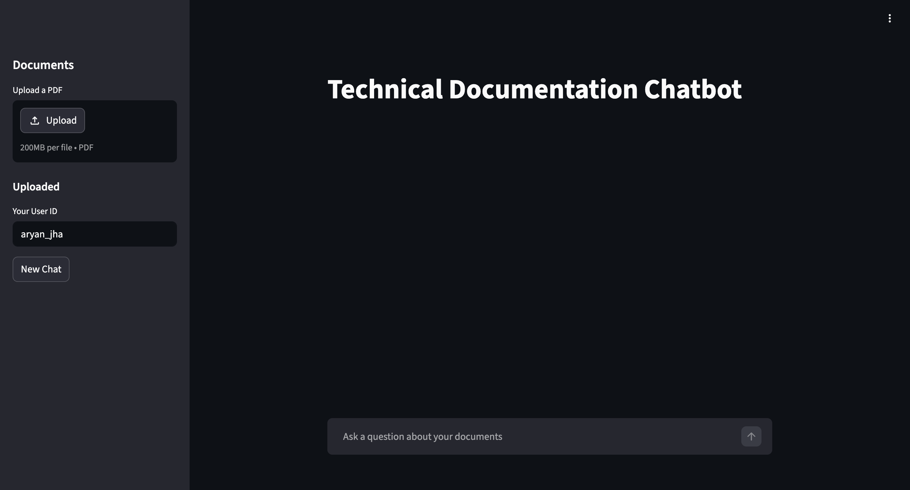
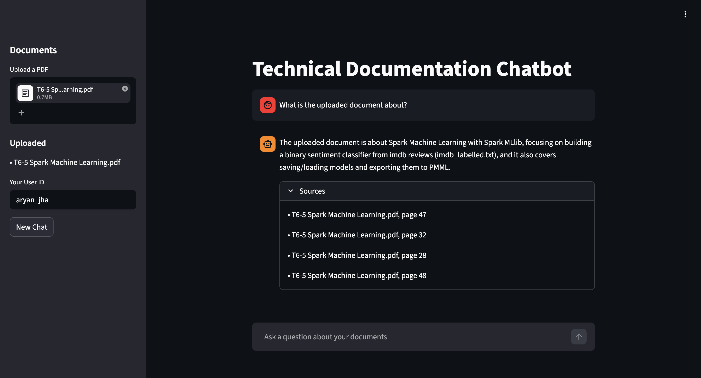
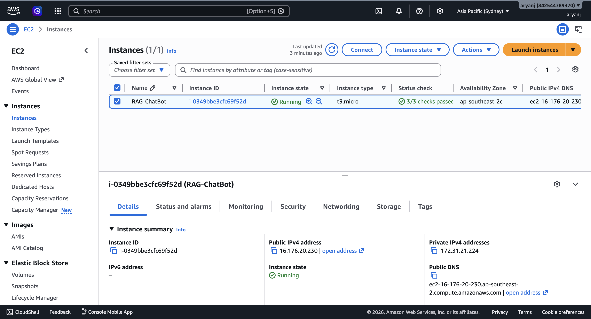
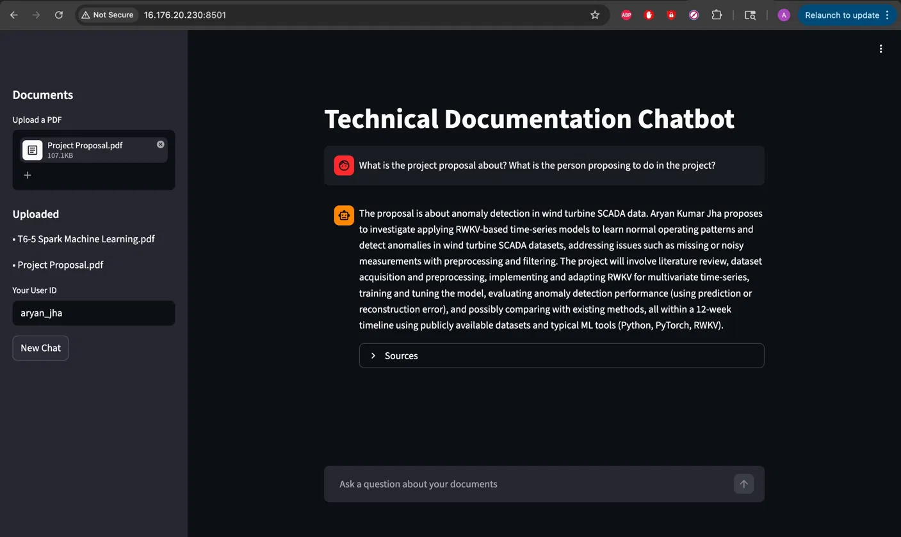

# Technical Documentation RAG Chatbot

A multi-user retrieval-augmented chatbot for technical PDFs, built with LangGraph, FastAPI, and Streamlit. Deployed on AWS EC2.

---

# Demo

## Screenshots









The application was previously deployed at:

`http://16.176.20.230:8501`

The EC2 instance has since been terminated to preserve AWS free-tier credits. The project can be redeployed using the included `docker-compose.yml`.

---

# Features

- Upload technical PDF documents and ask grounded questions against them
- Answers include source citations with page references
- Per-user document isolation using Chroma metadata filtering
- Multi-turn conversations with persistent thread memory via LangGraph `MemorySaver`
- Retrieval-augmented generation pipeline using OpenAI embeddings + Chroma vector store
- Evaluator node checks whether responses are grounded in retrieved context
- Automatic retry loop for ungrounded generations (max 2 retries)
- RAGAS benchmarking for:
  - Faithfulness
  - Response relevancy
- Containerized deployment with Docker Compose
- AWS deployment using EC2 + S3

---

# Architecture

## Ingestion Pipeline

```text
PDF Upload
    ↓
AWS S3 Storage
    ↓
pypdf Extraction
    ↓
RecursiveCharacterTextSplitter
    ↓
OpenAI Embeddings (text-embedding-3-small)
    ↓
Chroma Vector Store
```

## Query Pipeline

```text
User Query
    ↓
LangGraph Workflow

Retriever
(top-k similarity search from Chroma,
filtered by user_id)

    ↓

Generator
(gpt-5-nano grounded prompt)

    ↓

Evaluator
(LLM-as-judge:
Is the answer faithful to retrieved context?)

    ↓

If NOT faithful:
    loop back to Generator
    (max 2 retries)

    ↓

Return final answer + sources
```

---

# Benchmarks

| Configuration              | Faithfulness | Response Relevancy |
|----------------------------|--------------|---------------------|
| Baseline (weak prompt)     | 0.89         | 0.85                |
| Tightened prompt           | 1.00         | 0.90                |
| + Evaluator loop           | 0.99         | 0.88                |

Prompt tightening drove the biggest gain. The evaluator loop's value is on edge cases where the generator fails which may not be visible in averaged scores on standard queries.

Benchmark queries and evaluation scripts are available in:

```text
backend/benchmark.py
```

---

# Tech Stack

- Python 3.12
- FastAPI
- Streamlit
- LangChain
- LangGraph
- ChromaDB
- OpenAI API
  - `gpt-5-nano`
  - `text-embedding-3-small`
- RAGAS
- Docker + Docker Compose
- AWS
  - EC2
  - S3

---

# Setup (Local)

## 1. Clone the repository

```bash
git clone https://github.com/AryanJ-afk/rag-chatbot.git
cd rag-chatbot
```

## 2. Create environment variables

Create a `.env` file:

```bash
cp .env.example .env
```

Required environment variables:

```env
OPENAI_API_KEY=
AWS_ACCESS_KEY_ID=
AWS_SECRET_ACCESS_KEY=
AWS_REGION=
S3_BUCKET_NAME=
```

## 3. Start the application

```bash
docker compose up --build
```

## 4. Open the frontend

Streamlit UI:

```text
http://localhost:8501
```

FastAPI backend:

```text
http://localhost:8000
```

---

# Setup (Deployment)

## EC2 Configuration

Recommended AWS instance configuration:

| Resource | Recommendation |
|---|---|
| Instance Type | t3.micro |
| Storage | 16GB EBS |
| OS | Amazon Linux 2023 |
| Swap | Recommended |
| Open Ports | 22, 8000, 8501 |

## Security Group Rules

| Port | Purpose |
|---|---|
| 22 | SSH |
| 8000 | FastAPI backend |
| 8501 | Streamlit frontend |

## Deployment

SSH into the EC2 instance:

```bash
ssh -i <key.pem> ec2-user@<ec2-ip>
```

Clone the repository and run:

```bash
docker compose up --build -d
```

Application entry point:

```text
http://<ec2-ip>:8501
```

---

# Known Limitations / Future Improvements

- `MemorySaver` is currently in-process only
  - Replace with `SqliteSaver` or `PostgresSaver` for persistent memory across restarts

- Document deletion is not implemented
  - Chroma cleanup and S3 object deletion need coordinated handling

- `pypdf` struggles with complex layouts and scanned PDFs
  - `pymupdf` would provide more robust extraction

- RAGAS evaluations run synchronously
  - Should move to FastAPI `BackgroundTasks` or a queue worker

- No authentication layer
  - `user_id` is currently a text input field
  - Production deployment should integrate OAuth or AWS Cognito

- LangSmith tracing is not integrated

- Chroma is running locally inside the container
  - Production deployments should use a persistent volume or managed vector database

- No streaming token responses yet

- No automated document ingestion pipeline

- Evaluator loop uses the same model family as generation
  - Stronger judge models could improve reliability

---

# Project Structure

```text
.
├── backend/
│   ├── benchmark.py
│   ├── dockerfile
│   ├── evaluation.py
│   ├── evaluator.py
│   ├── generator.py
│   ├── graph.py
│   ├── ingest.py
│   ├── main.py
│   ├── metrics_log.py
│   ├── retriever.py
│   ├── s3_client.py
│   └── vector_store.py
│
├── docs/
│   └── screenshots/
│
├── frontend/
│   ├── app.py
│   └── dockerfile
│

├── .env.example
├── .gitignore
├── docker-compose.yml
├── README.md
└── requirements.txt
```